# eWorldES Employee Access Tracking Service

A CRUD web app to help DHS Internal Access Coordinators, Project Managers, and Business Analysts at eWorldES update, add, and track the DHS access of all eWorldES employees across many DHS projects. 

## Technology

### Backend -- FINISHED
- Spring Boot
- MySQL
### Frontend -- FINISHED
- HTML/CSS 
- JavaScript
### Cloud Services
- AWS (not started)
### Extra Features
- Spring Security (in progress)

### Build & Run for Windows OS
- Download and install Java
- Download and install MySQL DB and MySQL Workbench (https://www.simplilearn.com/tutorials/mysql-tutorial/mysql-workbench-installation)
    - Run Schemas "DB Schema" (Need to create) Folder in MySQL WorkBench
- Download and install Tomcat 8.5
- Edit application.properties file to include your own MySQL root username, password, and MySQL port
- Run EWorldAccessRequestApplicationTest on IntelliJ or another IDE

### Extra Features To-Do List
- Create a MySQL Docker Container
- Add Authentication Screen that possibly uses Bearer Tokens
- Add an "admin" account that can edit/delete Access Groups
- Add more frontend functionality to connect with more of my APIs (e.g, possibly re-enable findEmployeeByExpiration APIs)
- Make website look better

## Screenshots of Frontend
#### Index Page:
* Main page is built from a Bootstrap template. Buttons go to separate Employee and Access Group pages.
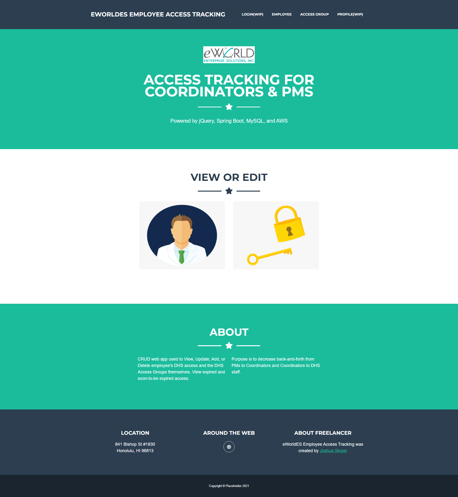
#### Main Employee Page (Read):
* Table is created w/ jQuery DataTables API
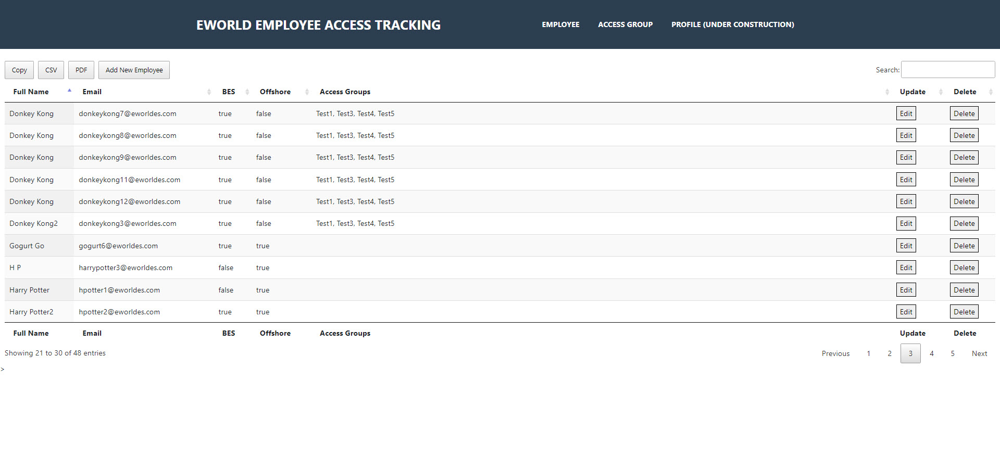
#### Adding an Employee (Create):
* Adding an Employee is as easy as filling in a few fields and checking off their appropriate Access Groups. After adding, you are sent back to the main Employee page.
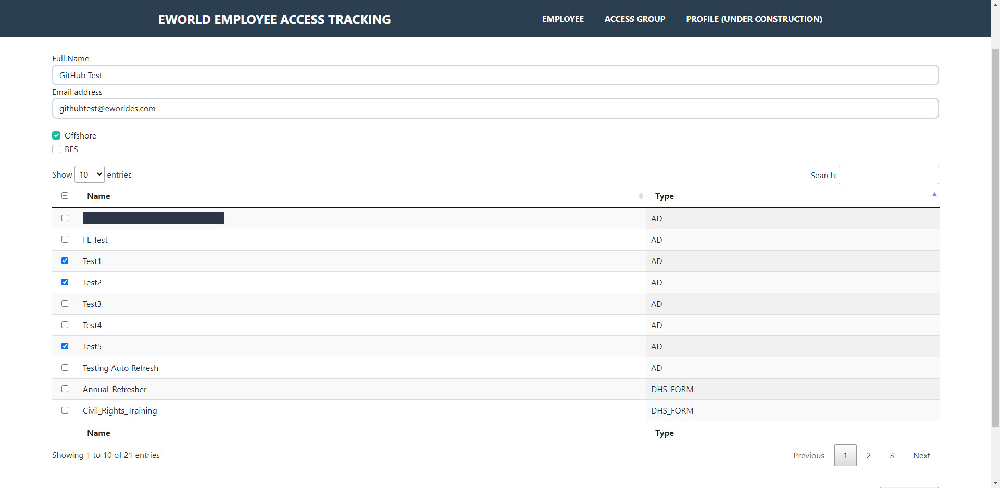
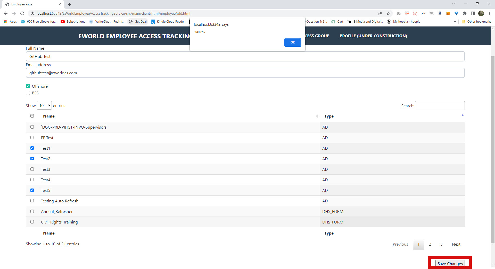
#### Updating an Employee (Update):
* Updating an Employee is as easy as unchecking removed Access Groups and adding new ones. You're also able to change name, email, offshore, and BES values. After updating, you are sent back to the main Employee page.

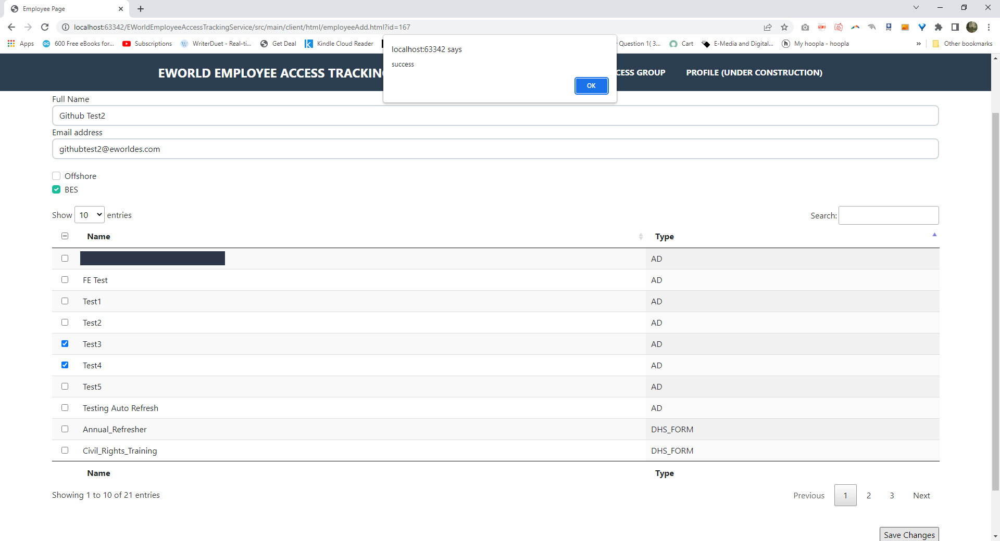
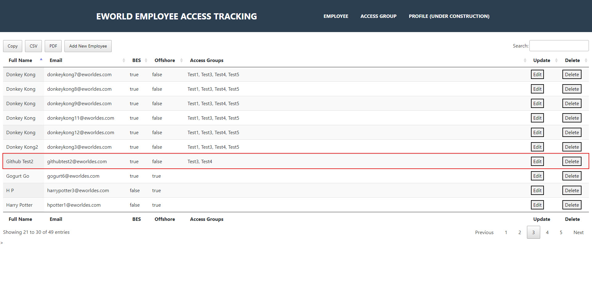
#### Deleting an Employee (Delete):
* After a confirmation prompt, the user is deleted from the DB, and the table is refreshed.
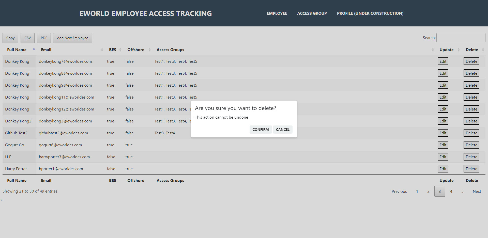
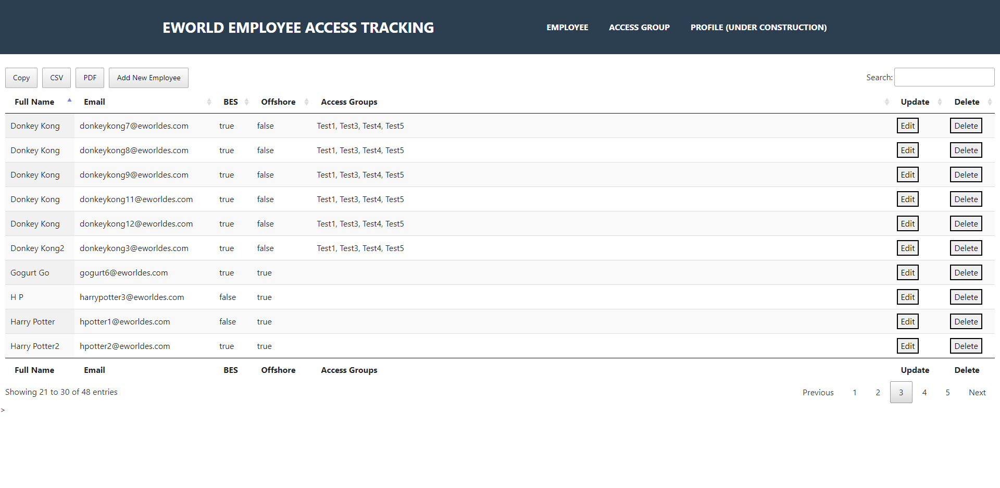
#### Adding an Access Group (Create):
* Adding access groups is as easy as determining a name and clicking its type. In theory, access groups will not be edited nor deleted, but I am planning to add those features once I finish the authentication as an "Admin" functionality. 
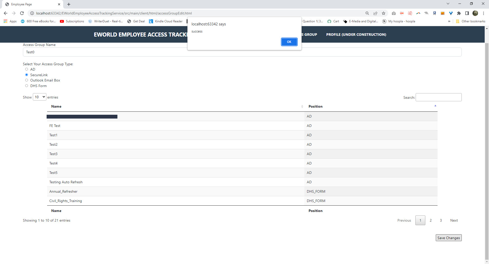
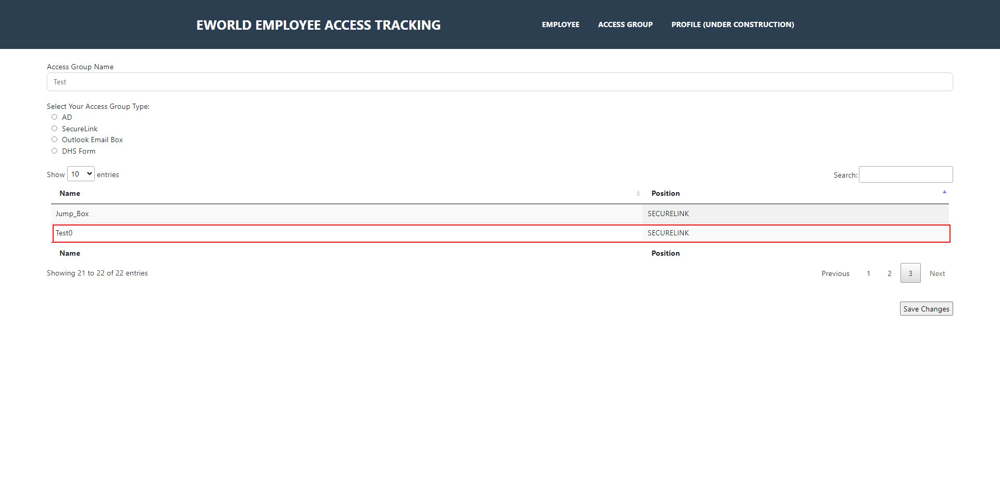

## Screenshots of Backend
#### POST Request formats fullName & email fields and returns detailed descriptions of assigned Access Groups:
  
* Response Body is a GET of Access Groups, which shows Name and Type fields. Notice how Employee's JSON Body only lists Access Group IDs.

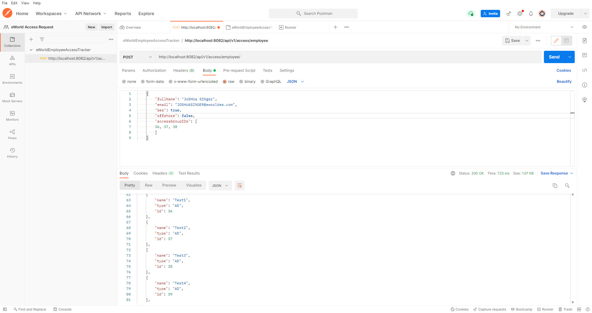

* POST Response returns with detailed Access Group information. Employee's ID is 107.

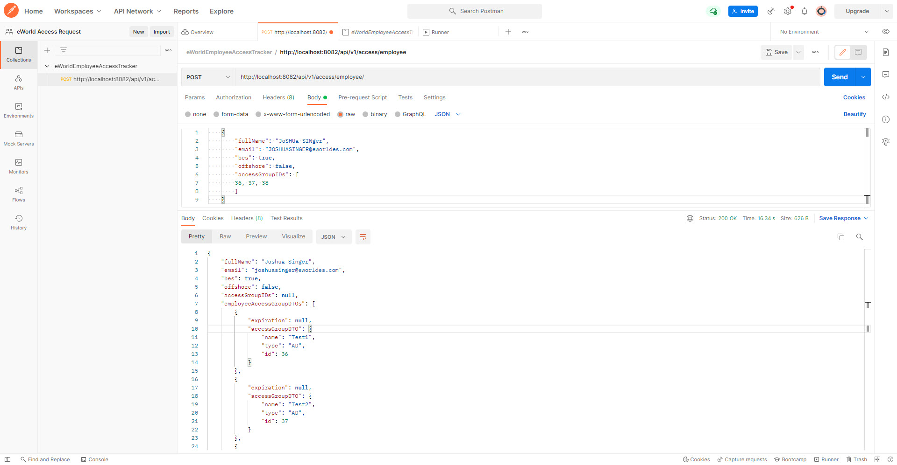

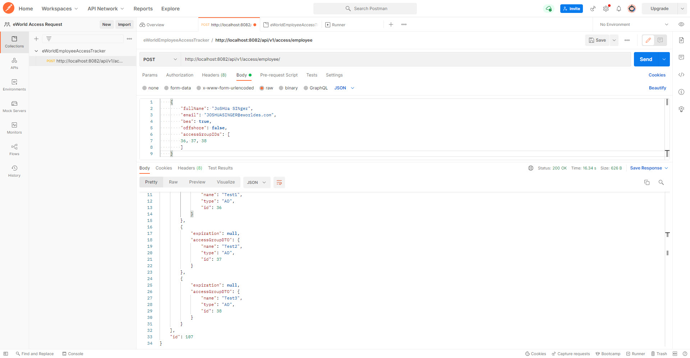

* POST is reflected in MySQL DB.

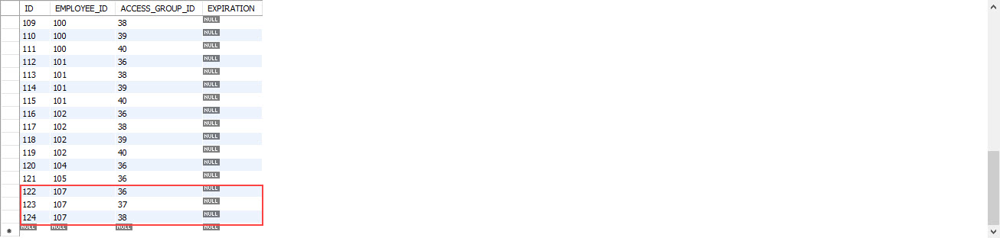

#### PUT Request preserves previous legitimate fields and updates Employee by removing absent Access Groups from DB while adding a new Access Group:

* In this PUT, Access Group 37 & 38 have been removed, but Access Group 39 has been added.

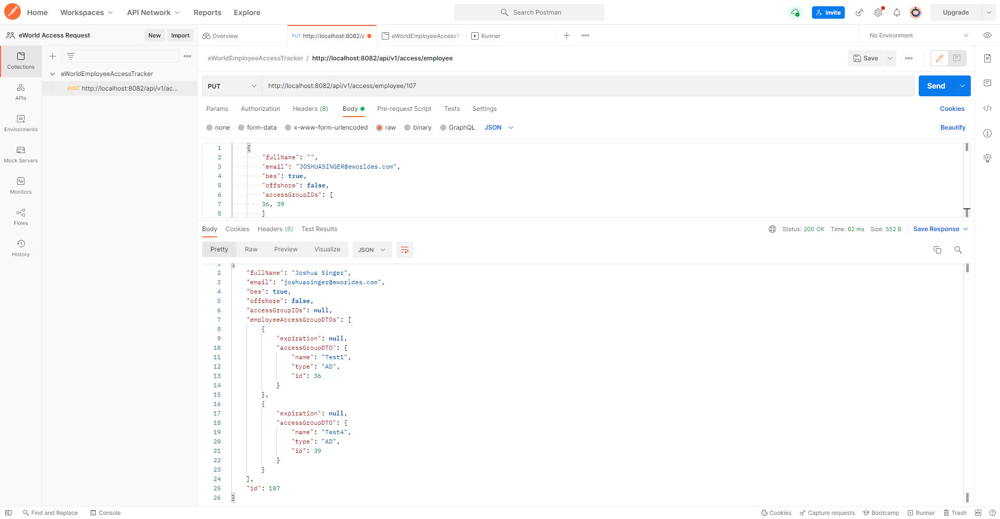

* PUT is reflected in MySQL DB.

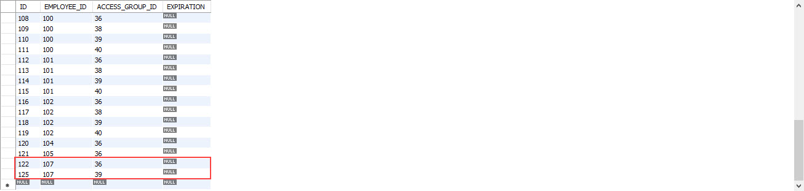

#### POSTing the same email returns a "Duplicate Entry" error:

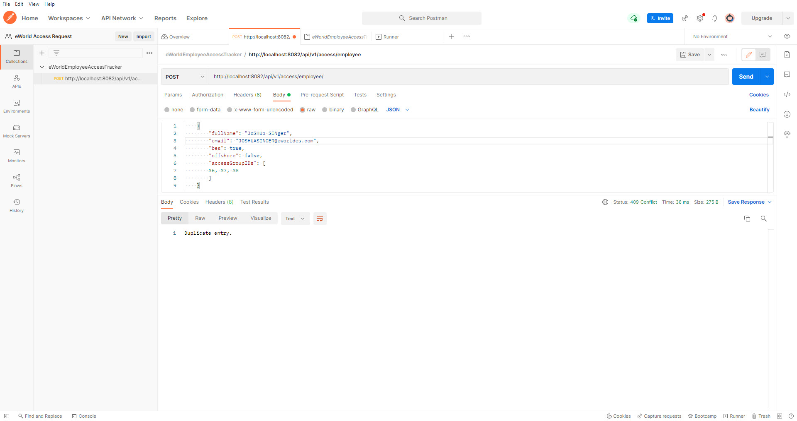

#### POSTing an Employee w/ a non-eWorldES email returns an "Invalid Email" error:

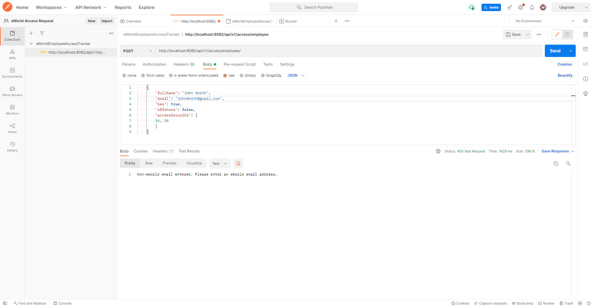

#### A list of all custom exceptions:

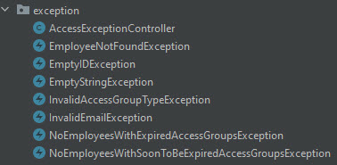

## Goals: 
- Replace the current tracking system in which the DHS access PDFs are stored in a SharePoint and cannot be queried 
- Reduce back-and-forth between DHS Internal Access Coordinators and Project Managers/Business Analysts 
- Improve programming skills

## Personal note: 
- First Spring Boot project 
- First project with Unit & Integration Tests
- First project with custom error handling
- First project with DTOs 
- Includes an expiration field tied to Employee_Access_Group that is no longer relevant due to eWorld policy changes but
is still present to exemplify my understanding of joined tables

Created by an Internal Access Coordinator as a side project.
